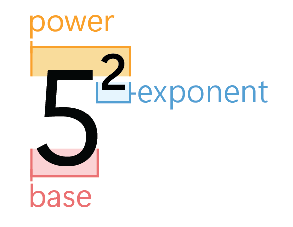

## How to say exponents?

- Small exponents (exp < 4), we use special words:

  - n^2: n squared
  - n^3: n cubed

- For larger exponents, normally we say `to the power of`:

  - n^4: n to the power of 4
  - 2^10: 2 to the power of 10

- For variable/expression exponents, we usually say `to the`:
  - 2^n: 2 to the n
  - a^(b+c): a to the (b plus c)
  - n^k: n to the k

### Tip

- Power of: more common when exponent (the powering number) is a specific number, specially bigger than 3

  - n^4: n being the base, 4 the exponent
  - n^4, n^5, n^100, etc

- To the: more common when the exponent is a variable or expression
  - 4^n: 4 being the base, n being the exponent as variable
  - 10^logn, x^(y-1), n^k

# 
